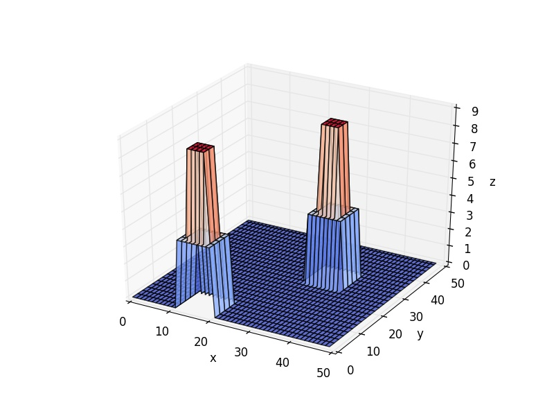
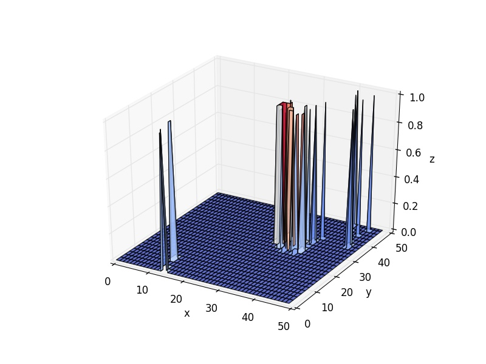

#Rabbit-Sugarscape

##介绍

Sugarscape意为大糖帝国，用于解决**为什么穷人越穷，富人越富?**的问题，相关介绍可移步[这里](http://blog.sina.com.cn/s/blog_5380a893010146a3.html)

文章描述内容很容易使用任一编程语言实现，但为了后续研究，比如尝试不同的策略，或者将每一步的糖人决策的过程记录下来到日志中，作进一步分析，这时就有很多重复的内容。因此```Rabbit-Sugarscape```，使用Java进行代码的封装，并开放接口给感兴趣的人群。使用```Rabbit-Sugarscape```能够让你专注糖人的策略，而不用考虑数据的记录，或调整地图等操作。

##基本工作原理

```Rabbit-Sugarscape```的主体流程如下步骤所示

- 用户制定地图大小，建议50*50以上，糖人数量，迭代次数（回合数）。
- 指定上述数据后，```Rabbit-Sugarscape```会生成地图，并随机生成糖心，并围绕糖心生成多糖区和少糖区。
- 生成n个糖人对象(n由用户指定)，糖人id为1~n，坐标随机（地图上每一个坐标可叠加糖人）
- 随后进入迭代中，迭代中，地图每2个回合回复糖分，每次迭代会随机打乱糖人列表，然后对活着的糖人依次执行```strategy```接口的update方法（用户需要实现该接口来自定义糖人的策略），执行后更新糖人位置和糖分信息。若糖人已死则从列表上去除，并更新地图信息。
- 迭代过程当满足用户指定迭代次数或糖人死光结束。


##数据可视化

完成模拟过程后，会在当前目录下生成```begin*.txt```,```end*.txt```,```logs.txt```分别为开始结束两个时间的资源和糖人信息。每一次迭代的信息日志。

使用python3.5运行``draw.py```脚本，其会根据```begin*.txt```,```end*.txt```生成3d图像，其中```x，y```为地图坐标,```z```轴取值为资源值或糖人人口值

##Demo

代码见```Demo.java```文件

资源分布



人口开始随机分布


迭代后人口集中在资源分布区



---

更多信息可查阅文档获得。
